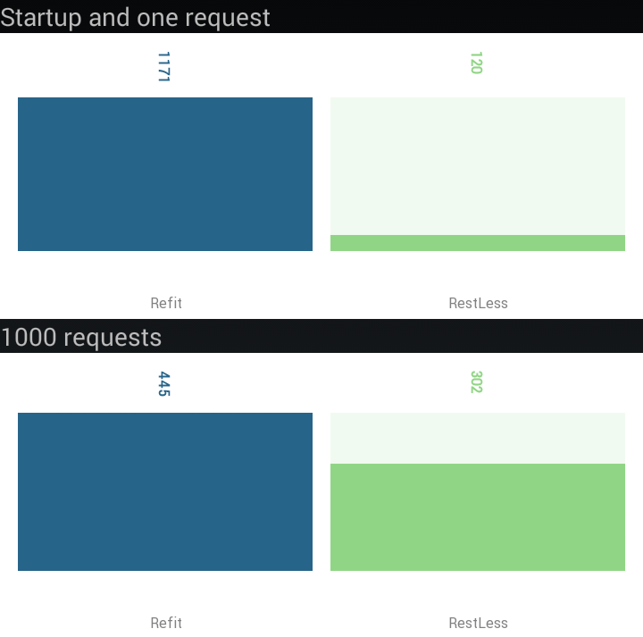

# RestLess

**RestLess** is another type-safe REST API client library.
It is heavily inspired by [Refit](https://github.com/paulcbetts/refit), which is inspired by [Retrofit](http://square.github.io/retrofit), but does not works exactly the same way.

In fact **RestLess** is built by keeping in mind that reflection is slow. When we build beautiful apps we don't want them to be slow down because of an external library, that's why all the **RestLess** REST clients are fully generated during the compilation.

This library fully supports the uri template defined by the [RFC6570](http://tools.ietf.org/html/rfc6570) thanks to [DoLess.UriTemplates](https://github.com/letsar/DoLess.UriTemplates).

## Performance comparison

The main goal of **RestLess** is to be fast. So I created a little benchmark project that can be run on Android.
I benchmarked Refit against **RestLess** for now, on two devices (time is in ms):

### Device 1

[Orange Nura](https://www.gsmmachine.com/orange-nura-2485.html)

This is an old device running under Android 4.4.



### Device 2

[Samsung Galaxy S8](https://www.gsmmachine.com/samsung-galaxy-s8-8439.html)

Samsung 2017 flagship runnind under Android 7.0.


### Conclusion

**RestLess** is really fast, especially at startup time. On an old device, with Refit, the startup time is more than one second while **RestLess** is 9 times faster with 120ms!
On the request time side, **RestLess** is faster thant Refit, but I don't think this is very relevant since the network will be the bottleneck.

## How it works

Install the NuGet package called **RestLess** and one of the extra package (like **RestLess.JsonNet**) into your project.
A **RestLess** folder with a file named RestClient.g.dl.rest.cs will be inserted in your project.
This file will allow you to create the Rest client from your interface without reflection.

As in Refit, you have to create an interface representing your REST API and use attributes to indicate what to do.
During the project compilation, all REST clients will be generated.

**Warning**: In Visual Studio for Mac, with versions prior to 0.7.1, the intellisense does not detect `RestClient`, but it will compile nonetheless.
From 0.7.1, you will have to close Visual Studio for Mac after adding this package and open it again. This is because Visual Studio for Mac keeps some project properties in cache.

## Install

Available on NuGet.

Install **RestLess**

[](https://www.nuget.org/packages/RestLess/)

Install **RestLess.JsonNet** if you want to serialize/deserialize using [Json.Net](https://github.com/JamesNK/Newtonsoft.Json)

[](https://www.nuget.org/packages/RestLess.JsonNet/)

## Quick start

### 1°) Create your REST API interface

```csharp
[Header("User-Agent", "RestLess")]
public interface IGitHubApi
{
    [Get("users{/userId}")]
    Task<User> GetUserAsync(string userId);
}
```

### 2°) Get the actual REST client

```csharp
IGitHubApi gitHubApi = RestClient.For<IGitHubApi>("https://api.github.com");
```

### 3°) Make the call

```csharp
User user = await gitHubApi.GetUserAsync("lestar");
```

## REST client customization

You can change the way the API works with two things: The ```HttpClient``` that can be passed to the ```For``` method, or with the ```RestSettings```

### HttpClient

The ```For``` method accepts a ```HttpClient```, so you can initialize it with a ```HttpMessageHandler```.
With this, you can set default headers with a runtime value that will be the same accross all calls. You can also create a ```DelegatingHandler``` for authentification, an other one for logging, etc.

### RestSettings

These settings are used directly by the requests generated by **RestLess**.

You can set custom parameters or formatters but the default ```RestSettings``` does not come with useful formatters (Because we don't want the core package to have a lot of dependencies).

For example, if you want to serialize/deserialize JSON content with [Json.Net](https://github.com/JamesNK/Newtonsoft.Json) you'll have to get the **RestLess.JsonNet** NuGet package.
Of course, you can write your own, if what you are looking for does not yet exists.

#### Custom parameters

Custom parameters can be set at runtime but they are common to the entire REST client. These parameters can be used inside ```HeaderAttributes``` (set the ```isCustomParameter``` parameter to true) or inside the uri templates defined into the [HTTP Method attributes](#http-method-attributes)

```csharp
settings.CustomParameters.Add("api_key", "bXlhcGlrZXk=");
```

#### Formatters

The formatters can change the way an object is serialized/deserialized. There must be a default formatter for each kind of formatter.

As opposed to **Refit** you can use a specific formatter for a method and use the default one for the others.

##### MediaTypeFormatters

These formatters are used to serialize/deserialize the body of a HTTP request/response from/into an object.

You can set a method-specific MediaTypeFormatter like this:

```csharp
RestSettings restSettings = new RestSettings();
restSettings.MediaTypeFormatters.Set("MediaTypeJsonFormatter", new MyMediaTypeJsonFormatter());

...

[Get("/whatever")]
[MediaTypeFormatter("MediaTypeJsonFormatter")]
Task<HttpResponseMessage> GetAsync();
```

##### UrlParameterFormatters

These formatters are used to serialize an object into a string. This string will be used to expand the variable in the uri template.

You can set a method-specific UrlParameterFormatter like this:

```csharp
RestSettings restSettings = new RestSettings();
restSettings.UrlParameterFormatters.Set("UrlParameterFormatter", new MyUrlParameterFormatter());

...

[Get("/whatever{?obj}")]
[UrlParameterFormatter("UrlParameterFormatter")]
Task<HttpResponseMessage> GetAsync(MyObject obj);
```

##### FormFormatters

These formatters are used to serialize an object into a ```IEnumerable<KeyValuePair<string,string>>``` that will be used to create an encoded url form content.

You can set a method-specific FormFormatter like this:

```csharp
RestSettings restSettings = new RestSettings();
restSettings.FormFormatters.Set("FormFormatter", new MyFormFormatterFormatter());

...

[Post("/whatever")]
[FormFormatter("FormFormatter")]
Task<HttpResponseMessage> PostAsync([FormUrlEncodedContent] MyObject obj);
```

## Attributes

### Setting the Http Method

In order to be identified as a REST interface, all methods of the interface must have a **HTTP Method attribute** that provides the request method and relative URL.

There are 8 built-in attributes: **Delete**, **Get**, **Head**, **Options**, **Patch**, **Post**, **Put** and **Trace**.
The relative URL of the resource must be specified as the argument of this attribute and it have to respect the [RFC6570 Uri template specification](http://tools.ietf.org/html/rfc6570).

*Note: You can use a literal string, or any expression (like a constant) as the attribute argument.*

```csharp
[Get("/users{/userId}")]
[Get("/users{?since}")]
```

A request URL can be updated dynamically with the values of the method parameters or through the *CustomParameters* of the ```RestSettings```class.
The parameter names are **case-insensitive**, so it will work correctly in this case:

```csharp
[Get("/users{/userid}")]
Task<HttpResponseMessage> GetUserAsync(string userId);
```

You can use the ```Name``` attribute to override the name of the parameter that will be used by the UriTemplate:

```csharp
[Get("/users{/userId}")]
Task<HttpResponseMessage> GetUserAsync([Name("userId")] string id);
```

### Setting global request uri prefix or suffix

If the REST API always starts with a common string, let's say a version number for example, you can put it into a ```UriTemplatePrefixAttribute```
Alternatively you can do the same if you REST API always ends with the same string, using the ```UriTemplateSuffixAttribute```

### Setting headers

There are three ways to set a header value:

#### With a constant

If you have a header with a constant value you can use the ```HeaderAttribute``` that way:

```csharp
[Header("User-Agent", "AppAgentForAllMethods")]
public interface IRestApi
{
    [Header("User-Agent", "AppAgentForThisMethodOnly")]
    Task<User> GetUserAsync();
    // .. Some code...
}
```

#### At runtime through the settings

You can also set a global header value at runtime for all the methods of your REST client:

```csharp
RestSettings restSettings = new RestSettings();
restSettings.CustomParameters.Add("apiKey", ApiKey);

...

[Header("User-Agent", "apiKey", true)]
public interface IRestApi
{
    // .. Some code...
}
```

#### Dynamically

If the content of the header can change between calls, you can apply a ```HeaderValueAttribute``` to a parameter:

```csharp
[Get("api/posts")]
Task<User> GetUserAsync([HeaderValue("User-Token")] string token);
```

### Overwrite header values

Redefining a header will replace it in the following order of precedence:

* ```Header``` attribute on the interface (**lowest priority**)
* ```Header``` attribute on the method
* ```HeaderValue``` attribute on a method parameter (**highest priority**)

## Setting the body content

You can add a body content to your request by applying the ```Content``` or the ```FormUrlEncodedContent``` attribute to a method parameter.

With the ```Content``` attribute, the parameter can have one the following types:

* ```HttpContent```
* ```Stream```
* ```string```
* ```byte[]```
* ```object```   => This will use the specified *MediaTypeFormatter* (or the default one if not set)
* ```FileInfo``` => This trigger creates a ```MultipartFormDataContent``` even if it is the only parameter

With the ```FormUrlEncodedContent``` attribute, the parameter can have one the following types:

* ```IEnumerable<KeyValuePair<string, string>>```
* ```object```   => This will use the specified *FormFormatter* (or the default one if not set)

You can decorate multiple parameters with the ```Content``` or the ```FormUrlEncodedContent``` attribute. The body of the request will be a ```MultipartFormDataContent```.
When you want to create a multipart request, the default name for each parameter will be the parameter name. You can ovveride this behavior with the ```Name``` attribute.
You  can also set an optional fileName or contentType through the attribute parameters.

Example:

```csharp
[Post("api/posts")]
Task<HttpResponseMessage> PostMultipartContent03Async([Content]string content, [Name("firstName")][Content("f", "text/plain")]string content2);
```

Will create a content like this:

```HTTP
--RestLessBoundary
Content-Type: text/plain; charset=utf-8
Content-Disposition: form-data; name=content

doe
--RestLessBoundary
Content-Type: text/plain
Content-Disposition: form-data; name=firstName; filename=f; filename*=utf-8''f

john
--RestLessBoundary--
```

## Retrieving the response

All the REST client methods must return a ```Task```.

You can set a generic parameter type to the ```Task```, the valid ones are:

* ```HttpResponseMessage```
* ```Stream```
* ```string```
* ```bool```     => This will return if the response has a success code without throwing an error
* ```byte[]```
* ```object```   => This will use the specified *MediaTypeFormatter* (or the default one if not set)

## Get response header

Sometimes REST APIS return useful information in the headers of the response.
You can get them by setting the `HeaderWriter`property of the `RestSettings`:

```csharp
public class HeaderWriter : IHeaderWriter
{
    public void Write(HttpResponseHeaders headers, object obj)
    {
        if (obj is IPagedResponse pagedResponse)
        {
            if (headers.TryGetValue(PaginationPage, out int page))
            {
                pagedResponse.Page = page;
            }

            if (headers.TryGetValue(PaginationPageCount, out int pageCount))
            {
                pagedResponse.PageCount = pageCount;
            }
        }
    }
}

...

mockHttp.Expect(HttpMethod.Get, url)
        .Respond(x =>
        {
            var response = new HttpResponseMessage(HttpStatusCode.OK)
            {
                Content = new StringContent("[{'firstName':'A','lastName':'AA'},{'firstName':'B','lastName':'BB'}]", Encoding.UTF8, "application/json")
            };

            response.Headers.Add(PaginationPage, "1");
            response.Headers.Add(PaginationPageCount, "2");

            return response;
        });

var settings = new JsonRestSettings()
{
    HttpMessageHandlerFactory = () => mockHttp,
    HeaderWriter = new HeaderWriter()
};

IApi09 restClient = RestClient.For<IApi09>(url, settings);
var people = await restClient.GetPagedPeopleAsync();

people.Page.ShouldBeEquivalentTo(1);
people.PageCount.ShouldBeEquivalentTo(2);
```

## Differences with Refit

Unlike Refit, the core of **RestLess** does not use reflection at runtime (For MediaFormatters it depends of the implementation). All the REST methods are generated during compile-time.

The *RestLess* package does not have any dependencies to another third-party library (except *DoLess.UriTemplates*). In order to read/write Json, you need to reference *RestLess.JsonNet* for example, but you can also write your own formatting strategies.

**RestLess** supports:

* Generic methods
* Method polymorphism
* The use of constants inside the attributes
* UriTemplates: see the [Spec](http://tools.ietf.org/html/rfc6570)
* Method specific formatters
* Getting response headers in the returned object

## Not supported features

Right now, **RestLess** does not supports:

* Interface inheritance
